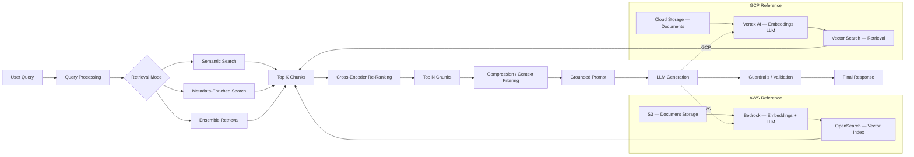

```mermaid
flowchart LR
    A[User Query] --> B[Query Processing]
    B --> C{Retrieval Mode}
    C --> C1[Semantic Search]
    C --> C2[Metadata-Enriched Search]
    C --> C3[Ensemble Retrieval]
    C1 --> D[Top K Chunks]
    C2 --> D
    C3 --> D
    D --> E[Cross-Encoder Re-Ranking]
    E --> F[Top N Chunks]
    F --> G[Compression / Context Filtering]
    G --> H[Grounded Prompt]
    H --> I[LLM Generation]
    I --> J[Guardrails / Validation]
    J --> K[Final Response]

    subgraph AWS["AWS Reference"]
        AWS1[S3 — Document Storage]
        AWS2[Bedrock — Embeddings + LLM]
        AWS3[OpenSearch — Vector Index]
        AWS1 --> AWS2 --> AWS3
    end

    subgraph GCP["GCP Reference"]
        GCP1[Cloud Storage — Documents]
        GCP2[Vertex AI — Embeddings + LLM]
        GCP3[Vector Search — Retrieval]
        GCP1 --> GCP2 --> GCP3
    end

    AWS3 --> D
    GCP3 --> D
    I -.->|AWS| AWS2
    I -.->|GCP| GCP2
```
