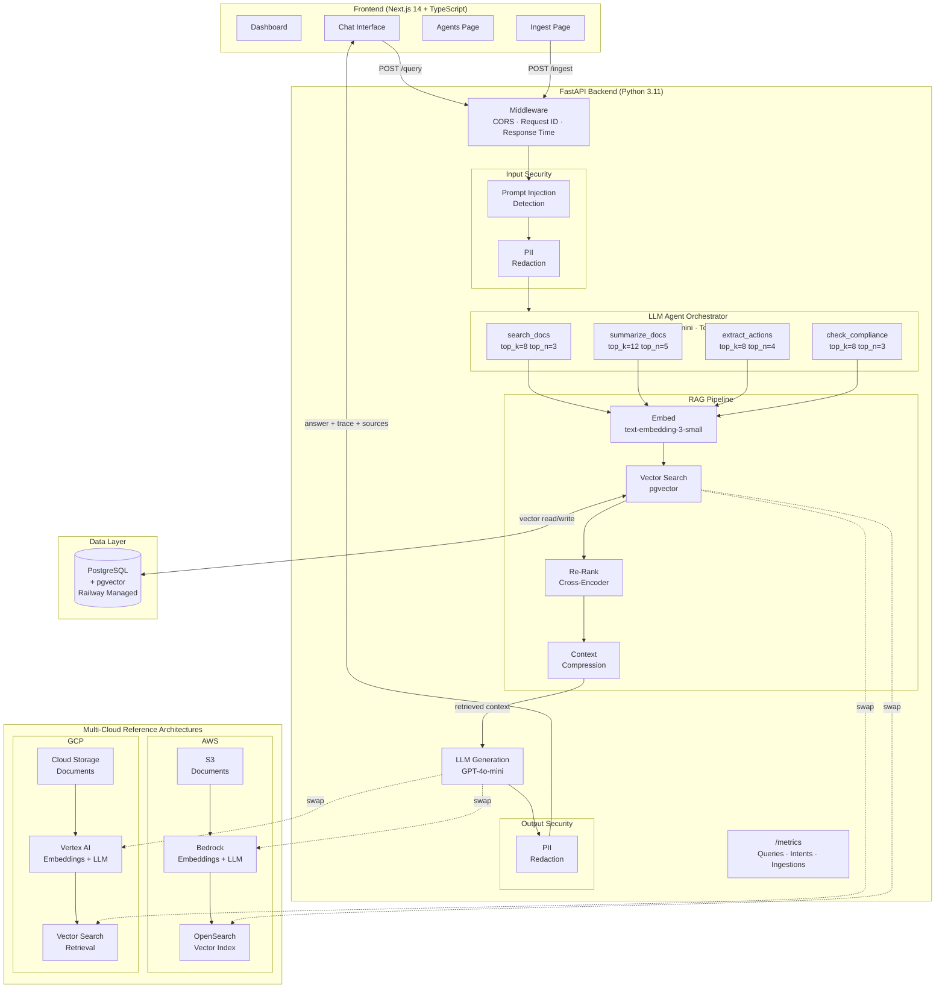
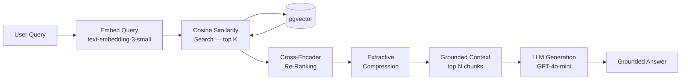
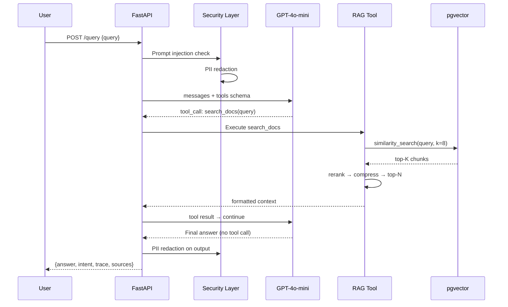
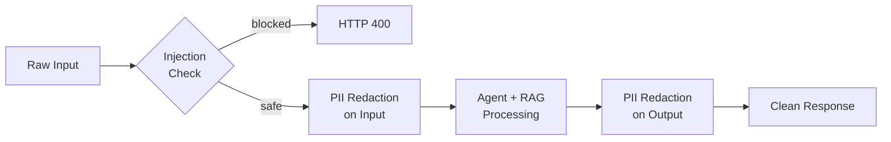
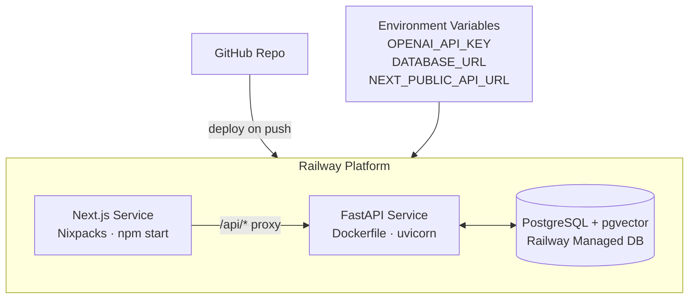

# Architecture Diagrams

## Full System Architecture

```mermaid
flowchart TB
    %% ── Frontend ──
    subgraph FE["Frontend  (Next.js 14 + TypeScript)"]
        direction LR
        FE_D[Dashboard]
        FE_C[Chat Interface]
        FE_A[Agents Page]
        FE_I[Ingest Page]
    end

    %% ── API Layer ──
    subgraph API["FastAPI Backend  (Python 3.11)"]
        direction TB
        MW["Middleware\nCORS · Request ID · Response Time"]
        subgraph SEC_IN["Input Security"]
            VI[Prompt Injection\nDetection]
            PI[PII\nRedaction]
        end
        subgraph AGENT["LLM Agent Orchestrator\n(GPT-4o-mini · Tool Calling)"]
            direction LR
            T1["search_docs\ntop_k=8  top_n=3"]
            T2["summarize_docs\ntop_k=12  top_n=5"]
            T3["extract_actions\ntop_k=8  top_n=4"]
            T4["check_compliance\ntop_k=8  top_n=3"]
        end
        subgraph RAG["RAG Pipeline"]
            direction LR
            EMB["Embed\ntext-embedding-3-small"]
            VS["Vector Search\npgvector"]
            RRK["Re-Rank\nCross-Encoder"]
            CMP["Context\nCompression"]
        end
        GEN["LLM Generation\nGPT-4o-mini"]
        subgraph SEC_OUT["Output Security"]
            PO[PII\nRedaction]
        end
        MET["/metrics\nQueries · Intents · Ingestions"]
    end

    %% ── Data Layer ──
    subgraph DB["Data Layer"]
        PG[(PostgreSQL\n+ pgvector\nRailway Managed)]
    end

    %% ── Multi-Cloud ──
    subgraph MC["Multi-Cloud Reference Architectures"]
        direction LR
        subgraph AWS["AWS"]
            AWS1[S3\nDocuments]
            AWS2[Bedrock\nEmbeddings + LLM]
            AWS3[OpenSearch\nVector Index]
            AWS1 --> AWS2 --> AWS3
        end
        subgraph GCP["GCP"]
            GCP1[Cloud Storage\nDocuments]
            GCP2[Vertex AI\nEmbeddings + LLM]
            GCP3[Vector Search\nRetrieval]
            GCP1 --> GCP2 --> GCP3
        end
    end

    %% ── Flow ──
    FE_C -->|POST /query| MW
    FE_I -->|POST /ingest| MW
    MW --> VI
    VI --> PI
    PI --> AGENT
    T1 & T2 & T3 & T4 --> EMB
    EMB --> VS
    VS --> RRK
    RRK --> CMP
    CMP -->|retrieved context| GEN
    GEN --> PO
    PO -->|answer + trace + sources| FE_C
    VS <-->|vector read/write| PG

    %% Multi-cloud alternatives
    VS -.->|swap| AWS3
    VS -.->|swap| GCP3
    GEN -.->|swap| AWS2
    GEN -.->|swap| GCP2
```

---

## RAG Pipeline Detail

```mermaid
flowchart LR
    Q[User Query] --> EMB[Embed Query\ntext-embedding-3-small]
    EMB --> SIM[Cosine Similarity\nSearch — top K]
    SIM --> PG[(pgvector)]
    PG --> SIM
    SIM --> RRK[Cross-Encoder\nRe-Ranking]
    RRK --> CMP[Extractive\nCompression]
    CMP --> CTX[Grounded Context\ntop N chunks]
    CTX --> GEN[LLM Generation\nGPT-4o-mini]
    GEN --> ANS[Grounded Answer]
```

---

## Agent Tool-Calling Loop

```mermaid
sequenceDiagram
    participant U as User
    participant API as FastAPI
    participant SEC as Security Layer
    participant LLM as GPT-4o-mini
    participant TOOL as RAG Tool
    participant DB as pgvector

    U->>API: POST /query {query}
    API->>SEC: Prompt injection check
    SEC->>SEC: PII redaction
    API->>LLM: messages + tools schema
    LLM-->>API: tool_call: search_docs(query)
    API->>TOOL: Execute search_docs
    TOOL->>DB: similarity_search(query, k=8)
    DB-->>TOOL: top-K chunks
    TOOL->>TOOL: rerank → compress → top-N
    TOOL-->>API: formatted context
    API->>LLM: tool result → continue
    LLM-->>API: Final answer (no tool call)
    API->>SEC: PII redaction on output
    API-->>U: {answer, intent, trace, sources}
```

---

## Security Guardrails

```mermaid
flowchart LR
    IN[Raw Input] --> IV{Injection\nCheck}
    IV -->|blocked| ERR[HTTP 400]
    IV -->|safe| PII1[PII Redaction\non Input]
    PII1 --> PROC[Agent + RAG\nProcessing]
    PROC --> PII2[PII Redaction\non Output]
    PII2 --> OUT[Clean Response]
```

---

## Deployment Architecture

```mermaid
flowchart TB
    subgraph Railway["Railway Platform"]
        FES[Next.js Service\nNixpacks · npm start]
        BES[FastAPI Service\nDockerfile · uvicorn]
        DBS[(PostgreSQL + pgvector\nRailway Managed DB)]
        FES -->|/api/* proxy| BES
        BES <--> DBS
    end
    GH[GitHub Repo] -->|deploy on push| Railway
    ENV[Environment Variables\nOPENAI_API_KEY\nDATABASE_URL\nNEXT_PUBLIC_API_URL] --> Railway
```
